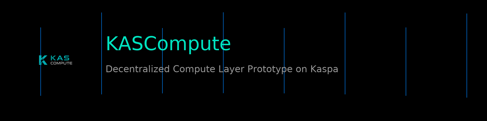

<p align="center">

&nbsp; 

</p>


<h1 align="center">KASCompute Protocol V1</h1>


<p align="center">

&nbsp; ⚡ Off-Chain Compute Layer aligned for Kaspa vProgs<br/>

&nbsp; Cryptographic Proof-of-Compute • Real-Time Nodes • ComputeDAG Scheduling

</p>


<p align="center">

&nbsp; <a href="https://kascompute.org">Website</a> •

&nbsp; <a href="https://dashboard.kascompute.org">Dashboard</a> •

&nbsp; <a href="https://github.com/KASCompute">GitHub</a>

</p>


---


\## 🧬 What is KASCompute Protocol V1?


\*\*KASCompute Protocol V1\*\* is the backend/API layer of KASCompute — an experimental off-chain compute network designed to align with \*\*Kaspa’s upcoming vProgs execution and settlement model\*\*.


It focuses on how decentralized compute can be:


\- \*\*measured\*\*

\- \*\*proven cryptographically\*\*

\- \*\*tracked in real time\*\*

\- and later \*\*anchored / settled via vProgs\*\*


> This repository is infrastructure-first: \*\*how the system operates\*\*, not promises.


---


\## ✅ What already works today


\### ⚙️ Network core

\- \*\*Node \& miner presence\*\* via heartbeat (role-aware: `node` vs `miner`)

\- \*\*Job scheduling\*\* (`/jobs/next`)

\- \*\*Leasing model\*\* (job TTL / re-queue semantics)


\### 🔐 Cryptographic Proof-of-Compute

Each proof is designed to be:

\- deterministic payload

\- \*\*SHA-256\*\* hash

\- \*\*Ed25519\*\* signature (identity-bound)

\- verifiable receipts


Endpoints:

\- \*\*Proof submission:\*\* `/jobs/proof`


> Important: cryptography is real — proofs are hashable, signable, and verifiable.


\### 🧩 ComputeDAG (Protocol V1)

Mainnet-ready scheduling model for deterministic task graphs:

\- submit immutable DAG spec (hash-derived IDs)

\- create execution runs

\- task leasing \& deterministic scheduling

\- run/spec views for UI rendering


---


\## ⚡ Architecture Overview (vProgs alignment)


\*\*Kaspa L1 (BlockDAG)\*\*  

└─ Finality \& Security


\*\*vProgs (Future Execution Layer)\*\*  

└─ Proof anchoring  

└─ Conditional settlement


\*\*KASCompute (Off-Chain Layer)\*\*  

├─ Node heartbeats  

├─ Job scheduling  

├─ Proof-of-Compute  

├─ ComputeDAG execution engine  

└─ Dashboard + Launcher integrations


🔹 \*\*Today:\*\* off-chain R\&D prototype  

🔹 \*\*Future:\*\* trust-minimized settlement via vProgs


---


\## 💠 KCT Emission Model (Concept)


| Parameter | Value |

|---|---:|

| Total Supply | 10B KCT |

| Mining | 9B (90%) |

| Treasury | 1B (10%) |

| Start Reward | 200 KCT / block |

| Decay | 1% monthly |

| Duration | ~14 years |


Formula: `R(m) = 200 \* 0.99^(m)`  

\*(Accounting/demo in current builds. Parameters may evolve.)\*


---


\## 🖥 Live Dashboard (Prototype)


🔗 https://dashboard.kascompute.org


\- node presence \& uptime

\- proof stream (cryptographic data)

\- work units \& performance

\- emission modeling


---


\## 🚀 Quickstart


\### Requirements

\- Rust (stable)

\- Cargo


\### Build \& run

```bash

cargo build --release

cargo run --release

Logs

RUST\_LOG=info cargo run

Tip: search the codebase for Router::new() to see the exact routes for this version.


🧱 Repository notes

src/state.rs — core state, scheduler policy, proof acceptance, ComputeDAG runtime


src/domain/ — models/types


src/util/ — receipts, signatures, hashing, geo, time helpers


docs/ — protocol notes and v1.1 spec/checklist


assets/ — banners, diagrams, visuals


🟡 v1.1 (in progress): Rewards \& Accounting

Work-in-progress branch:


feature/v1.1-rewards-accounting


Planned:


miner/node split (80/20)


protocol fee (configurable)


CU-based weighting (future-proof for AI/rendering/batch)


prevent double counting in reward window


balance + stats endpoints


See:


docs/protocol-v1.1-rewards.md


docs/v1.1-checklist.md


🔒 Official Project Notice

This repository represents an official KASCompute codebase.


Official sources:


🌐 Website: https://kascompute.org


💻 GitHub: https://github.com/KASCompute


🖥 Dashboard: https://dashboard.kascompute.org


The KASCompute name, logo, branding, and public communication are not covered by the MIT license.

Forking the code is allowed, but claiming affiliation with KASCompute is not.


📫 Contact

🌐 https://kascompute.org


🐦 https://x.com/KASCompute


💬 https://t.me/KASCompute


Founder: Tarik Kaya

Built with ⚡ \& 💚 on Kaspa.

